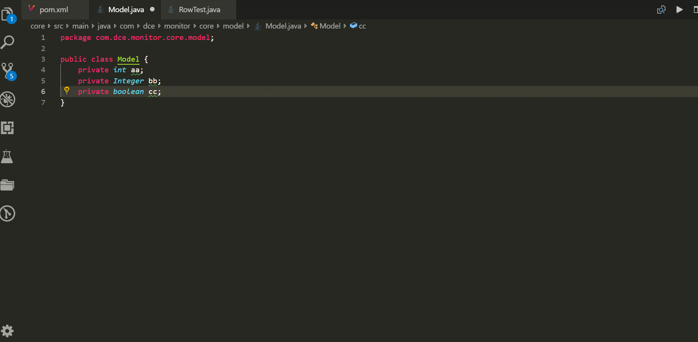

<h2 align="center"> AutoCoder</h2>

<strong>AutoCoder can generate builder pattern code for java</strong>

- [🌴Usage](#usage)
- [💮Features](#features)
- [⚙️Settings](#️settings)
- [🤣Restrictions](#restrictions)
- [🐛Known Issues](#known-issues)

## 🌴Usage

## 💮Features

- Generate Builder command: autocoder generate builder pattern code for java bean.
- Menu: if editorFocus is java file,right click mouse,you can run generate command.
- Command: you can input autocoder keyword for triggering generate command.
- Interesting feature: after run generate command,you can add new fields , then run again.

## ⚙️Settings

autocoder is so easy, only two settings you should take care.

| Setting          | Description                                             | Type    | Default Value |
| ---------------- | ------------------------------------------------------- | ------- | ------------- |
| autocoder.indent | indent with tab or space                                | String  | space         |
| autocoder.space  | if autocoder.indent=space, you can choose 2\|4\|8 space | Integer | 4             |

## 🤣Restrictions

- regenerate code will delete some code that you added,you should save before running regenerate.

## 🐛Known Issues

please file issue at [github](https://github.com/simahao/autocoder/issues)

**Enjoy!**
